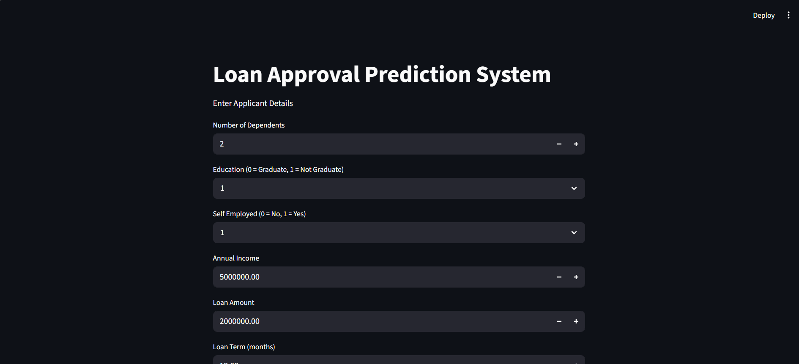
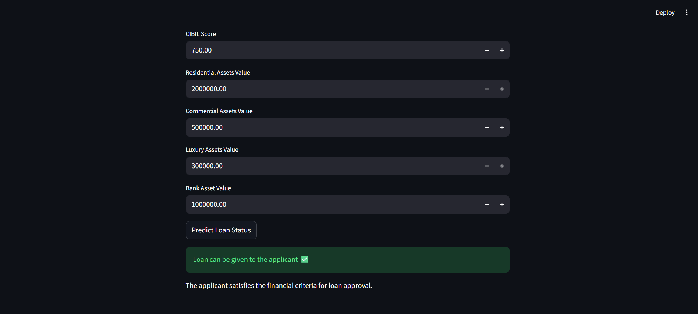

# Loan Risk Prediction System

## Project Highlights

✔ End-to-end Machine Learning pipeline   
✔ Feature Engineering for financial risk indicators\
✔ Handling imbalanced data using SMOTE\
✔ Hyperparameter tuning using GridSearchCV\
✔ Streamlit dashboard for real-time prediction\
✔ Achieved **95.6% accuracy using SVM**

---

## Project Overview

This project builds a machine learning system that predicts whether a loan can be given to an applicant based on financial and demographic information.
The system analyzes features such as income, loan amount, credit score, and asset values to estimate loan eligibility.

The goal is to demonstrate a complete machine learning workflow including data analysis, feature engineering, model training, and deployment through an interactive web interface.

---

## Dataset

The dataset contains applicant financial information and loan details used to predict loan approval eligibility.

### Key Features

* Number of Dependents
* Education Level
* Self Employment Status
* Annual Income
* Loan Amount
* Loan Term
* CIBIL Score
* Residential Asset Value
* Commercial Asset Value
* Luxury Asset Value
* Bank Asset Value

### Target Variable

* **loan_status**

  * `1` → Loan can be given to the applicant
  * `0` → Loan cannot be given to the applicant

---

## Exploratory Data Analysis (EDA)

Exploratory data analysis was performed to understand the dataset structure and identify relationships between variables.

Main observations:

* Credit score (CIBIL score) strongly influences loan approval.
* Income and loan amount show a strong correlation.
* Asset values contribute to determining loan eligibility.
* Some features required transformation to better represent financial risk.

---

## Feature Engineering

Additional financial indicators were created to improve model performance:

* **total_assets** = sum of all asset values
* **loan_to_income_ratio** = loan amount divided by income
* **asset_to_loan_ratio** = total assets divided by loan amount
* **income_per_dependent** = income divided by number of dependents

These features help represent the applicant's financial strength.

---

## Handling Imbalanced Data

The dataset had class imbalance between approved and rejected loans.

To address this issue:

* **SMOTE (Synthetic Minority Oversampling Technique)** was applied to balance the training dataset.

---

## Machine Learning Models

Several machine learning models were trained and compared:

* Logistic Regression
* Support Vector Machine (SVM)
* K-Nearest Neighbors (KNN)

Hyperparameter tuning was applied using **GridSearchCV** to improve model performance.

### Best Model

**Support Vector Machine (SVM)** performed best with an accuracy of approximately **95.6%** on the test dataset.

---

## Model Performance

| Model                        | Accuracy  |
| ---------------------------- | --------- |
| Logistic Regression          | ~91%      |
| K-Nearest Neighbors (KNN)    | ~92%      |
| Support Vector Machine (SVM) | **95.6%** |

Evaluation metrics used:

* Accuracy
* Precision
* Recall
* F1 Score
* Confusion Matrix

These metrics ensure balanced performance across both loan approval and rejection classes.

---

## System Architecture

The overall system workflow is shown below:

```
User Input (Streamlit Dashboard)
        ↓
Feature Engineering
        ↓
Standard Scaler
        ↓
SVM Model
        ↓
Loan Eligibility Prediction
```

---

## Streamlit Web Application

A Streamlit dashboard was developed to allow users to interact with the trained model.

Users can input applicant information and receive an instant prediction on whether a loan can be given to the applicant.

### Streamlit Dashboard



### Prediction Example



---

### Run the Streamlit App

```
streamlit run app/streamlit_app.py
```

---

## 📁 Project Structure

📦 loan-risk-prediction\
┣ 📂 app\
┃ ┗ 📄 streamlit_app.py\
┣ 📂 data\
┃ ┣ 📂 processed\
┃ ┃ ┣ 📄 loan_processed.csv\
┃ ┃ ┣ 📄 test_data.csv\
┃ ┃ ┗ 📄 train_balanced.csv\
┃ ┗ 📂 raw\
┃ ┗ 📄 loan_approval_dataset.csv\
┣ 📂 models\
┃ ┣ 📄 scaler.pkl\
┃ ┗ 📄 svm_model.pkl\
┣ 📂 notebooks\
┃ ┣ 📄 01_eda.ipynb\
┃ ┣ 📄 02_feature_engineering.ipynb\
┃ ┗ 📄 03_model_training.ipynb\
┣ 📄 requirements.txt\
┣ 📄 README.md\
┗ 📄 .gitignore

---

## Technologies Used

* Python
* Pandas
* NumPy
* Scikit-learn
* Imbalanced-learn (SMOTE)
* Streamlit

---

## Future Improvements

* Add model explainability using SHAP
* Improve the Streamlit interface with additional visualizations
* Deploy the application to a cloud platform
